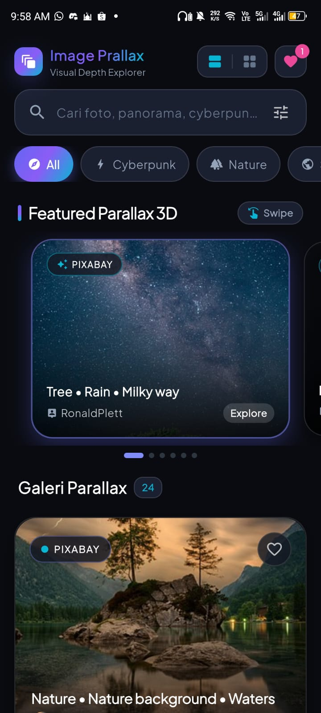
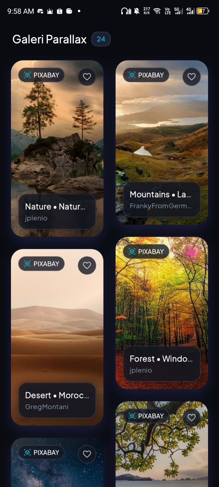
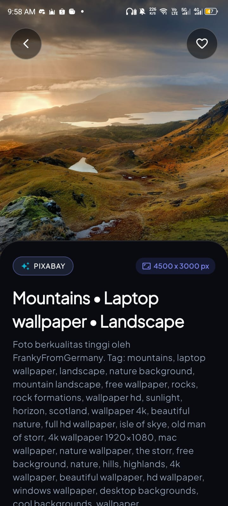

# 🌌 Lumen Parallax Image Explorer (Flutter)

A modern, high-performance Flutter application for exploring and searching high-definition photography with multi-layered **Parallax Effects**, fluid micro-animations, and a sleek dark luxury UI aesthetic.

---

## 📱 Preview Aplikasi

<div align="center">

### 🎥 Video Demo Interaktif
<video src="preview.mp4" width="300" controls="controls" poster="img1.jpeg">
  <p>Browser Anda tidak mendukung tag video. Silakan tonton <a href="preview.mp4">video preview di sini</a>.</p>
</video>

<p><em>▶️ Tonton langsung rekaman video: <a href="preview.mp4"><strong>preview.mp4</strong></a></em></p>

### 📸 Tangkapan Layar (Screenshots)

<table>
  <tr>
    <td align="center" width="33%">
      
      <br />
      <sub><b>Beranda & 3D Carousel</b></sub>
    </td>
    <td align="center" width="33%">
      
      <br />
      <sub><b>Mode 3D Tilt Grid</b></sub>
    </td>
    <td align="center" width="33%">
      
      <br />
      <sub><b>Detail & Wallpaper Parallax</b></sub>
    </td>
  </tr>
</table>

</div>

---

## ✨ Fitur Utama (Key Features)

### 1. Multi-Layer Parallax Effects
- **FlowDelegate Scroll Parallax**: Menggunakan Flutter `Flow` dan `FlowDelegate` resmi untuk pergerakan gambar latar yang sangat halus (60/120 FPS hardware-accelerated) mengikuti posisi kartu di dalam scroll viewport.
- **Horizontal 3D Carousel Parallax**: Carousel kurasi di bagian atas dengan efek pergeseran internal gambar (`PageView` delta offset) berkecepatan ganda dan animasi skala bertahap.
- **Interactive 3D Perspective Tilt**: Mode kartu grid dengan matriks 4D (`Matrix4.identity()..setEntry(3, 2, 0.0018)..rotateX(..)..rotateY(..)`) yang merespons sentuhan jari (pan) atau kursor mouse (hover) dengan specular light glint dan label mengambang (holographic depth).
- **Parallax Header Detail View**: Halaman detail dengan latar belakang berkecepatan 0.45x dari scroll, transisi Hero, dan interactive pinch-to-zoom.

### 2. Powerful Search & Filtering
- **Debounced Instant Search**: Pencarian cerdas secara langsung dengan penundaan debounce (350ms) agar performa tetap responsif.
- **Kategori Preset Cepat**: Filter instan berdasarkan tema (Cyberpunk, Nature, Space, Architecture, Anime, Minimalist, Vehicles).
- **Filter Sheet**: Opsi orientasi (Landscape, Portrait, Semua), pengurutan (Terpopuler, Terbaru), dan integrasi API.

### 3. Pixabay API Integration & Environment Variables
- **Environment Variable (`.env`)**: Konfigurasi token API Pixabay disimpan secara aman di file `.env` (menggunakan `flutter_dotenv`) dan tidak di-*hardcode* pada repositori git.
- **Pixabay Live Search**: Terintegrasi langsung dengan API Pixabay untuk mencari jutaan gambar berkualitas tinggi secara live.
- **Curated Offline Fallback**: Dilengkapi koleksi kurasi HD resolusi tinggi sebagai fallback otomatis jika perangkat offline atau koneksi jaringan terputus.

### 4. Fitur Wallpaper & Download Galeri
- **Simulasi & Pengaturan Wallpaper**: Mode studio pratinjau penuh layar dengan toggle Layar Kunci (*Lock Screen*) & Layar Utama (*Home Screen*), penyesuaian framing zoom/pan, dan opsi penerapan wallpaper.
- **Progress Download & Simpan ke Galeri**: Menampilkan visual progress bar, kecepatan unduh (KB/s), persentase real-time, dan menyimpan foto langsung ke Galeri perangkat (`gal` package) pada album *"Image Parallax"*.
- **Koleksi Favorit (Persistent)**: Menyimpan foto yang disukai ke penyimpanan lokal (`shared_preferences`) dengan animasi detak jantung dan counter badge.
- **Mode Tampilan Ganda**: Tombol pengubah tampilan antara *Feed Parallax* dan *3D Tilt Grid*.

---

## 🛠️ Struktur Proyek

```
lib/
├── main.dart                      # Inisialisasi aplikasi, tema, dan status bar
├── models/
│   └── image_item.dart            # Data model foto, rasio aspek, dan JSON serialization
├── services/
│   └── image_service.dart         # Layanan pencarian online & dataset kurasi, manajemen favorit
├── theme/
│   └── app_theme.dart             # Palet warna gelap obsidian, gradien neon, tipografi Outfit & Plus Jakarta Sans
├── widgets/
│   ├── download_progress_dialog.dart # Dialog visual download progress & simpan galeri
│   ├── filter_sheet.dart          # Modal bottom sheet untuk orientasi & filter lanjutan
│   ├── parallax_3d_card.dart      # Kartu 3D tilt perspective interaktif (gesture & hover)
│   ├── parallax_card.dart         # Kartu vertikal dengan FlowDelegate parallax scroll
│   ├── parallax_carousel.dart     # Carousel horizontal dengan 3D PageView parallax
│   ├── search_bar_widget.dart     # Bar pencarian mengambang dan pill filter kategori
│   └── shimmer_placeholder.dart   # Efek shimmer skeleton loading
└── screens/
    ├── favorites_screen.dart      # Layar daftar foto favorit tersimpan
    ├── home_screen.dart           # Layar utama (pencarian, feed parallax, grid 3D)
    ├── image_detail_screen.dart   # Layar detail dengan parallax header & download
    └── wallpaper_preview_screen.dart # Layar studio wallpaper (Lockscreen/Homescreen)
```

---

## 🚀 Cara Menjalankan (Getting Started)

### Prasyarat
- Flutter SDK 3.19+ (Diuji pada Flutter 3.44 / Dart 3.12)
- Koneksi internet untuk memuat gambar resolusi tinggi

### Menjalankan di Perangkat

1. **Konfigurasi Environment (`.env`)**:
   Salin template `.env.example` menjadi `.env` lalu masukkan API Key Pixabay Anda:
   ```bash
   cp .env.example .env
   ```

2. **Jalankan di Android / iOS**:
   ```bash
   flutter run
   ```

3. **Jalankan di macOS Desktop**:
   ```bash
   flutter run -d macos
   ```

4. **Jalankan di Web (Chrome)**:
   ```bash
   flutter run -d chrome
   ```

---

## 📄 Lisensi & Kredit
- Gambar bersumber dari fotografer [Unsplash](https://unsplash.com) melalui CDN resolusi tinggi.
